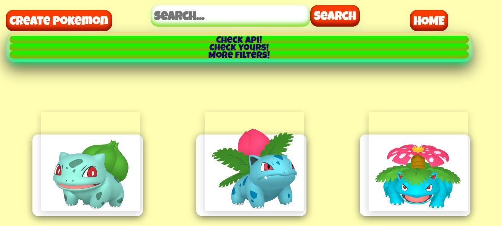
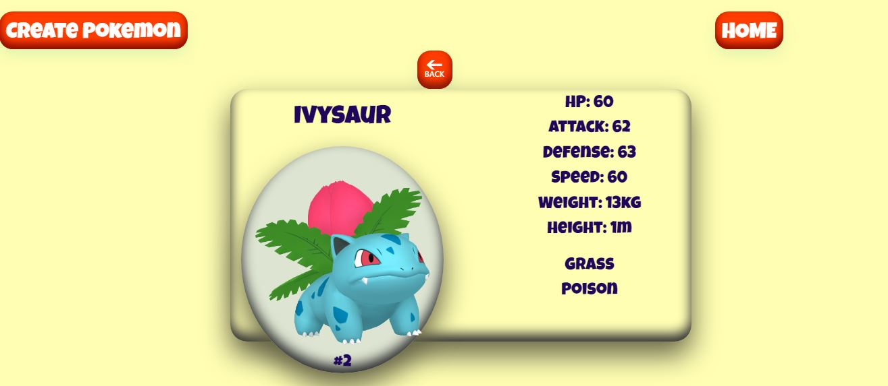
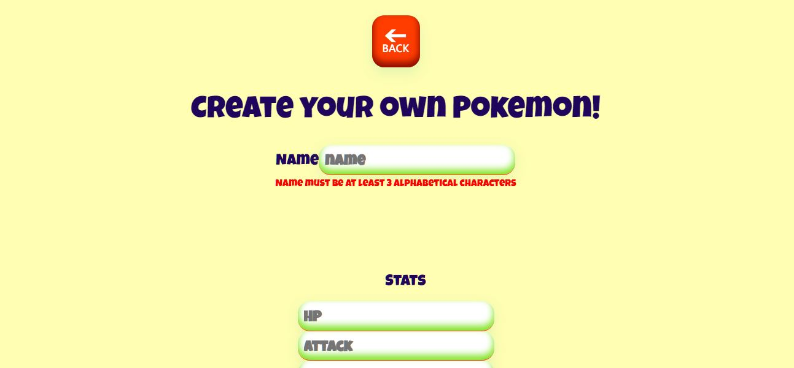

# MARVEL+

This app was the final project to been graduated as Full Stack Developer. 
This app would allow to  get,by a regular payment , access to lecture to Marvel comics. For those who arenpt payoing yet would be able to navigate in the hole catalogue of comics and characters. There are some filters and search bars to offer a better UX. 
For the owner, there is a private module qhere ios possible to add and remove comics, upgrade users nd get stats about billing and other key points for bussines.
The design and componenting was made to be affordable and adaptatives.

## Getting Started

These instructions will get you a copy of the project up and running on your local machine for development and testing purposes.
<br/>
-Clone this repo.

### Prerequisites
- Database is requiered for some services, like login, and allow you to save information too.
- Then run *npm install* to get dependencies

```
Be sure to have installed PostgreSQL and create a database called marvel
```

### Installing

When dependencies are installed, you are almost done! 
Just run npm start at :directory: backend and :directory: frontend directories.
The project will run by default at port 3000 and you  run on your browser and backend should be listening at 3001.

```
The project will run by default at port 3000 and you may watch it running on your browser
```
<p align="left">
  
</p>

```
backend should be listening at 3001.
```

<p align="left">
  
</p>

<!--- faltan los test por aquí --->

## Built With

* React-Redux-JS
* Node Js- Sequelize - Postgress
* Some amazing styles and icons libraries as Semantic (https://semantic-ui.com/) UI and Material UI (https://v4.mui.com/)


## Authors

* **LucianaCHA** - (https://github.com/LucianaCHA)
* **LucianaCHA** - (https://github.com/LucianaCHA)
* **LucianaCHA** - (https://github.com/LucianaCHA)
* **LucianaCHA** - (https://github.com/LucianaCHA)  
* **LucianaCHA** - (https://github.com/LucianaCHA)


## :pushpin: Previews :pushpin:

<div >
<p align="left">
  

  
  

 
  


  


</p>
    </div>

